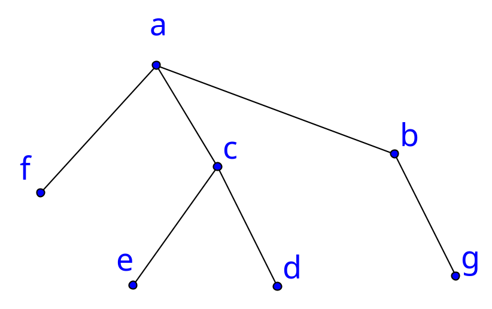
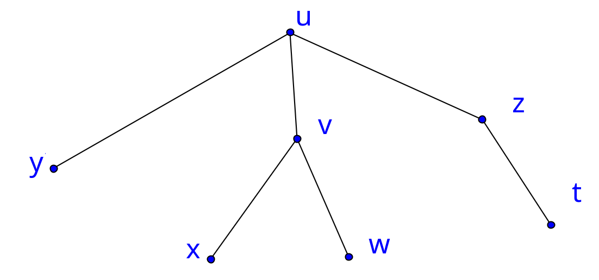
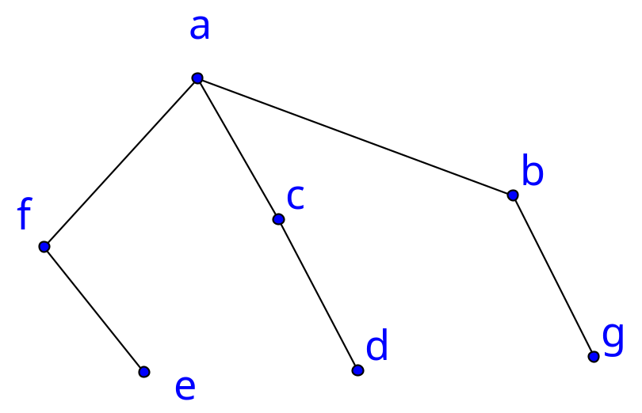
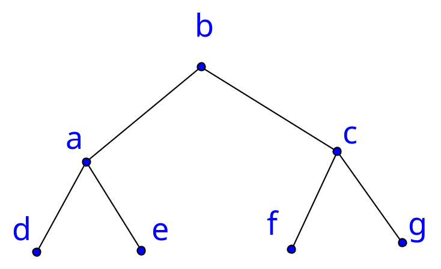

# CSC 208: Discrete Math Graphs Test 1 Solutions

Consider the graph $G_1 = (V_1, E_1)$ with $V_1 = \{a, b, c, d, e, f, g\}$ and
$E_1 = \{\{a, b\}, \{a, c\}, \{a, f\}, \{b, g\}, \{c, d\}, \{c, e\}\}$.

1. Is the graph isomorphic to
   $G_2 = (V_2, E_2)$ with $V_2 = \{t, u, v, w, x, y, z\}$ and
   $E_2 = \{\{t, z\}, \{u, v\}, \{u, y\}, \{u, z\}, \{v, w\}, \{v, x\}\}$? If
   so, give the isomorphism. If not, explain how you know.

   > The following function $f$ defines an isomorphism from $G_1$ to $G_2$:
   > ```math
   > \begin{array}{l|lllllll}
   > x & a & b & c & d & e & f & g \\
   > \hline
   > f(x) & u & z & v & w & x & y & t \\
   > \end{array}
   > ```
   > The following diagrams allow us to visualize this isomorphism.
   > ### $G_1$ Diagram
   > 
   > ### $G_2$ Diagram
   > 


2. Find a graph $G_3$ with 7 vertices and 6 edges which is *not* isomorphic to
   $G_1$, or explain why this is not possible.

   > ### $G_3$ Diagram
   > 


3. Write down the *degree sequence* for the vertices of $G_1$ in decreasing
   order.

   > I decided to make Python do this for me, so I wrote the following
   > program:
   > ```python
   >
   > from functools import cmp_to_key
   >
   >
   > V1 = {'a', 'b', 'c', 'd', 'e', 'f', 'g'}
   > E1 = ({'a', 'b'}, {'a', 'c'}, {'a', 'f'}, {'b', 'g'}, {'c', 'd'}, {'c', 'e'})
   >
   >
   > def compare_verts(v1, v2):
   >     if v1[1] > v2[1]:
   >         return 1
   >     if v1[1] < v2[1]:
   >         return -1
   >     if v1[0] < v2[0]:
   >         return 1
   >     if v1[0] > v2[0]:
   >         return -1
   >     return 0
   >
   >
   > def degree(vertex, edges):
   >     d = 0
   >     for edge in edges:
   >         if vertex in edge:
   >             d += 1
   >     return d
   >
   >
   > def degrees(f, E1):
   >     verts = []
   >     for v in f:
   >         verts.append((v, degree(v, E1)))
   >    return sorted(verts, key=cmp_to_key(compare_verts), reverse=True)
   >
   >
   > raw_degree_seq = degrees(V1, E1)
   > degree_seq_strs = [f'{d[0]}:{d[1]}' for d in raw_degree_seq]
   > print(', '.join(degree_seq_strs))
   > ```
   > Which produced the following output:
   >
   > ```
   > a:3, c:3, b:2, d:1, e:1, f:1, g:1
   > ```


4. Find a connected graph $G_4$ with the same degree sequence as $G_1$ which
   is *not* isomorphic to it, or explain why this is not possible.

   > ### $G_4$ Diagram
   > 
