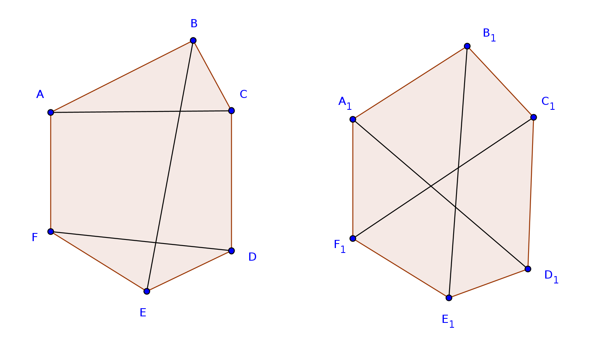

# Section 2.1: Problems and Definitions Exercises


## Exercise 1

If 10 people each shake hands with each other, how many handshakes took place?
What does this question have to do with graph theory?

> We can model the people as vertices and the handshakes as edges. Since
> eveyone is shaking hands with everyone else, this is the **complete graph**
> $K_10$, and there are ${10 \choose 2}$ or
> $\frac{10 \cdot 9}{2} = 45$ total handshakes.


## Exercise 2

Among a group of 5 people, is it possible for everyone to be friends with
exactly 2 of the people in the group? What about 3 of the people in the group?

> Let the 5 people be the vertices of a graph.  If they are connected in the
> cyclic graph, $C_5$, and if we describe each edge of the graph as indicating
> the *friendship* relationship, then it is clear that each of the 5 people
> in the group can be friends with exactly two others.
>
> Can each of the 5 people be friends with exactly 3 others? No. By
> *Proposition 4.1.8*, in any graph, the number of vertices with odd degree
> must be even.  We have 5 vertices here, and if they each had degree 3, there
> would be an odd number of vertices with odd degree, contradicting the
> proposition.


## Exercise 3

Is it possible for two *different* (non-isomorphic) graphs to have the same
number of vertices and the same number of edges?  What if the degrees of the
degrees of the vertices in the two graphs are the same (so both graphs have
vertices with degrees 1, 2, 2, 3, and 4, for example)? Draw two such graphs
or explain why you can not.

> Below we have two graphs:
> ```math
> \begin{align*}
> G_0 &= \{\{A, B, C, D, E, F\}, \{\{A, B\}, \{B, C\}, \{C, D\}, \{D, E\},
> \{E, F\}, \{F, A\}, \{A, C\}, \{B, E\}, \{D, F\}\}\} \\
> G_1 &= \{\{A_1, B_1, C_1, D_1, E_1, F_1\}, \{\{A_1, B_1\}, \{B_1, C_1\},
> \{C_1, D_1\}, \{D_1, E_1\}, \{E_1, F_1\}, \{F_1, A_1\}, \{A_1, D_1\},\
> \{B_1, E_1\}, \{C_1, F_1\}\}\}
> \end{align*}
> ```
>  
>
> They have the same number of vertices (6), and each vertex is of the same
> degree (3), yet the two graphs are clearly *not* isomorphic. $\{A, C\}$ is
> an edge in $G_0$, but $\{A_1, C_1\}$ is not an edge in $G_1$, for example.


## Exercise 4

Are the two graphs below equal? Are they isomorphic? If they are isomorphic,
give the isomorphism. If not, explain how you know they are not.
```math
G_1: V = \{a, b, c, d, e\}, E = \{\{a, b\}\, \{a, c\}, \{a, e\}, \{b, d\},
         \{b, e\}, \{c, d\}\}.
```
<figure>

<figcaption>
G<sub>2</sub>
</figcaption>
</figure>

> Let's rewrite $G_2$ in set notation, renaming the vertices to avoid
> confusion:
> ```math
> G_2: V = \{v_c, v_d, v_e, v_a, v_b\}, E = \{\{v_c, v_d\}\, \{v_c, v_a\},
> \{v_c, v_b\}, \{v_d, v_e\}, \{v_d, v_a\}, \{v_e, v_b\}\}.
> ```
> While $V_{G_1} = V_{G_2}$, $E_{G_1} \neq E_{G_2}$, since $\{a, b\}$ is
> in one, but not the other, for example, so $G_1$ and $G_2$ are not equal.
> They are isometric, however, since we can define a function
> $f: G_1 \rightarrow G_2$ as 
> $f(a) = v_c, f(b) = v_d, f(c) = v_e, f(d) = v_a, f(e) = v_b$ which meets the
> requirement that for each edge $\{x, y\}$ in $G_1$,
> $\{f(x), f(y)\}$ is an edge in $G_2$.


## Exercise 5

Consider the following two graphs:

$$
G_1: V_1 = \{ a, b, c, d, e, f, g \},
E_1 = \{ \{ a, b \}, \{ a, d \}, \{ b, c \}, \{b, d \}, \{ b, e \}, \{ b, f \},
\{ c, g \}, \{ d, e \}, \{ e, f \}, \{ f, g \} \}.
$$

$$G_2: V_2 = \{v_1, v_2, v_3, v_4, v_5, v_6, v_7\},
E_2 = \{\{v_1, v_4\}, \{v_1, v_5\}, \{v_1, v_7\}, \{v_2, v_3\}, \{v_2, v_6\},
\{v_3, v_5\}, \{v_3, v_7\}, \{v_4, v_5\}, \{v_5, v_6\}, \{v_5, v_7\}\}.$$


### Part (a)

Let $f: G_1 \rightarrow G_2$ be a function that takes the vertices of Graph 1
to vertices of Graph 2. The function is given by the following table:

```math
\begin{array}{l|lllllll}
x & a & b & c & d & e & f & g \\
f(x) & v_4 & v_5 & v_1 & v_6 & v_2 & v_3 & v_7 \\
\end{array}
```

Does $f$ define an isomorphism between Graph 1 and Graph 2?

> We are asking here if $f$ is the required bijection
> $V_1 \rightarrow V_2$ such that
> $\{a, b\} \in E_1 \iff \{f(a), f(b)\} \in E_2$.
