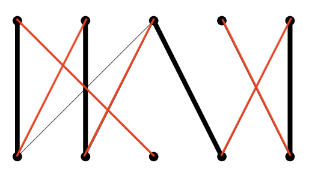

# Graph Theory: Section 4.6: Matching in Bipartite Graphs

by Jamethiel Risacher, Marin McCormack, Cody Finnegan, Shangwen Cheng, and
Anfal Hosen


## Introduction

- Bipartite graphs are a type of graph where vertices can be divided into two
  disjoint sets.
- Each edge connects a vertex in one set to a vertex in the other set.
- Matching in bipartite graphs is a fundamental concept in graph theory.


## Examples of Bipartite Graphs

- Example 1: Job assignment problem
  - Set $A$: Jobs
  - Set $B$: Workers
- Example 2: Course registration
  - Set $A$: Courses
  - Set $B$: Students


## Matching in Bipartite Graphs

A matching of the graph is a subset of the edges for which each vertex of A
belongs to exactly one edge of the subset, and no vertex in B belongs to more
than one edge in the subset. 

- Maximum matching: The largest possible matching in a bipartite graph.
- Perfect matching: A matching that covers every vertex in the graph.


##  Hall's Marriage Theorem

- **Theorem:** A bipartite graph $G$ with $A$ and $B$ in two groups of
  vertices. Let $S$ be a subset of $A$. $N(S)$ is the set of all the neighbors
  of vertices in $S$.

- Formally: $\forall S \subseteq A, |N(S)| \geq |S|$.


## Applications of Bipartite Graph Matching

- Job assignment problems
- Stable marriage problem
- Network flow problems
- Task scheduling
- Resource allocation


##  Conclusion

- Matching in bipartite graphs is a crucial concept with wide applications.
- Hall's Marriage Theorem provides a fundamental criterion for perfect matching.


## Question 1


## Question 2

A bipartite graph that doesn't have a matching might still have a partial
matching.  By this we mean a set of edges for which no vertex belongs to more
than one edge (but possibly belongs to none).

Every bipartite graph (with at least one edge) has a partial matching, so we
can look for the largest partial matching in a graph.  Your “friend” claims
that she has found the largest partial matching for the graph below (her
matching is in bold).

She explains that no other edge can be added, because all the edges not used in
her partial matching are connected to matched vertices.  Is she correct?


Short answer: no.




## Question 3

One way you might check to see whether a partial matching is maximal is to
construct an **alternating path**. This is a sequence of adjacent edges, which
alternate between edges in the matching and edges not in the matching (no edge
can be used more than once). If an alternating path starts and stops with an
edge not in the matching, then it is called an **augmenting path**.

### 3a:

Find the largest possible alternating path for the partial matching of your
friend's graph. Is it an augmenting path? How would this help you find a larger
matching?


Because the path starts and finishes with an edge that was not in the partial
matching, this is an augmenting path. This helps us because it means we can
change the alternation, turning the non-matching edges into matching edges.
This new partial match will be larger than the original.

### 3b:

Find the largest possible alternating path for the partial matching below. Are
there any augmenting paths? Is the partial matching the largest one that exists
in the graph?


This is the largest alternating path I could find, but it is not an augmenting path, which means that the partial match given is also the largest one possible.


## Question 4

The two richest families in Westeros have decided to enter into an alliance by
marriage. The first family has 10 sons, the second has 10 girls. The ages of
the kids in the two families match up. To avoid impropriety, the families
insist that each child must marry someone either their own age, or someone one
position younger or older. In fact, the graph representing agreeable marriages
looks like this:


The question: how many different acceptable marriage arrangements which marry
off all 20 children are possible?

### 4a

How many marriage arrangements are possible if we insist that there are
exactly 6 boys who marry girls not their own age?


The graph above represents a possible combinatino above which fits the problem
of marrying exactly 6 boys to 6 girls not their own age. In the graph above,
you can see 3 X's and 4 I's. The 3 X's represents 6 boys marrying 6 grils not
their own age. The 4 I's represents 4 boys marrying 4 girls that are the same
age. 

What we can do is treat the X's and I's as objects. The total number of objects
is 7 (3 X's and 4 I's). Now we can use this formula for the number permutations
of $n$ objects with $n_1!, n_2!, ... , n_k!$ indistinguishable objects is:
```math
\frac{n!}{n_1! \cdot n_2! \cdot ... \cdot n_k!}
```

The $n!$ on the numerator meants the factorial of the total number of objects
or $7!$ The denominator would be the product of the 2 objects factorials or
$4! \cdot 3!$ By doing the equation we get: $7! \over 3! \cdot 4! = 35$. 

B. Look at smaller family sizes and get a sequence.

This question wants us to look at smaller family sizes! We'll do something
similar to question 1 but we will trace all the possible combination of family
sizes, and see if a pattern emerges. 

Let's start with a family size of 1 (1 son and 1 daughter):


With this family size, there is only one possible marriage arrangement.

Let's look at a family size of 2.


With a family size of 2, there are 2 marriage arrangements (Either marrying the
same age, or marrying different age)

Now let's continue with a couple of more family sizes

Family size of 3 (3 arrangements)


Family size of 4 (5 arrangements)


Family size of 5 (8 arranagements)


Okay, that was a lot of X's and I's, and it might be hard to tell at first but
we are seeing an interesting relationship when the family size increases. Let's
observe a table!

| Family Size      | Combinations |
| ----------- | ----------- |
| 1      | 1       |
| 2   | 2        |
| 3      | 3       |
| 4   | 5        |
| 5      | 8       |


If you observe the table closely, you can see that after 2 family members, the
next family size is the addition of the previous 2! We can now use this
knowledge to figure out the total family size with a family size of 10.

| Family Size      | Combinations |
| ----------- | ----------- |
| 4      |  5      |
| 5  | 8     |
| 6     | 13      |
| 7  | 21    |
| 8     | 34      |
| 9  | 55       |
| 10    | 89      |

There are a 89 combinatinos with a family size of 10!!


### C. Can you give a recurrence relation that fits the problem?

Wait a minute! That looks like a sequence we have seen before! The Fibonacci
Sequence!
```math
\begin{align*}
a_n &= a_{n-1} + a_{n-2} \\
a_1 &= 1 \\
a_2 &= 2
\end{align*}
```


## Sources: 

* [Matching in Bipartite Graphs: Marriage Arrangements](https://www.youtube.com/watch?v=MSn7eZFs7HU&t=301s) [YouTube Video]
* [What is Bipartite Graph](https://www.geeksforgeeks.org/what-is-bipartite-graph/)
* [Fibonacci sequence](https://www.techtarget.com/whatis/definition/Fibonacci-sequence)
* [Introduction to Matching in Bipartite Graphs (Hall's Marriage Theorem)](https://www.youtube.com/watch?v=ooPLtxKXJPo&t=3s)
* [Hall’s Marriage Theorem explained intuitively](https://luckytoilet.wordpress.com/2013/12/21/halls-marriage-theorem-explained-intuitively/)
* [Matching (graph theory)](https://en.wikipedia.org/wiki/Matching_(graph_theory)) 
* [Hungarian algorithm](https://en.wikipedia.org/wiki/Hungarian_algorithm) 
* [Hopcroft–Karp algorithm](https://en.wikipedia.org/wiki/Hopcroft%E2%80%93Karp_algorithm)
